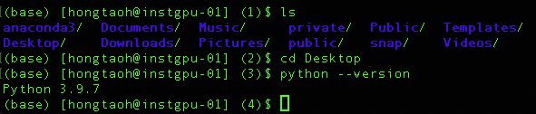

# Research Plan

[Qual plan](https://docs.google.com/document/d/1jnMgjwZNFWPuCUl52HYE9qfjmSAwBoK7jPolEyDMkYY/edit#heading=h.uu0xfphd1x4u)

### Timeline

- June 10 & 11: Back to normal work
  - Review all the material here and get myself familar with the theory and math again. 

- June 12: Explore GPU resources

  - Instgpu at CS department (`ssh xxx@instgpu-01.cs.wisc.edu`, free)
  - [CHTC](https://chtc.cs.wisc.edu/) (free but hard to use)
  - Google Cloud Platform (paid service)
  - Professor Joe's resources

- June 13 - June 20: Testing and Debugging codes on GPU

- June 21 - June 30:
  - Access data
  - Convert data to numerical form
  - Understand data
  - Process data

- July 1 - June 10: Modeling data using GPU
- July 10 - July 20: Write the report
- July 20 - August 1: Prepare for the presentation
- August 1 - August 10: Read about and consider multi sequences
- August 11 - August 20: Implement multi sequences using mock data
- August 21 - August 25: Prepare for the presentation again
- August 26, 2024: Present for the qual exam